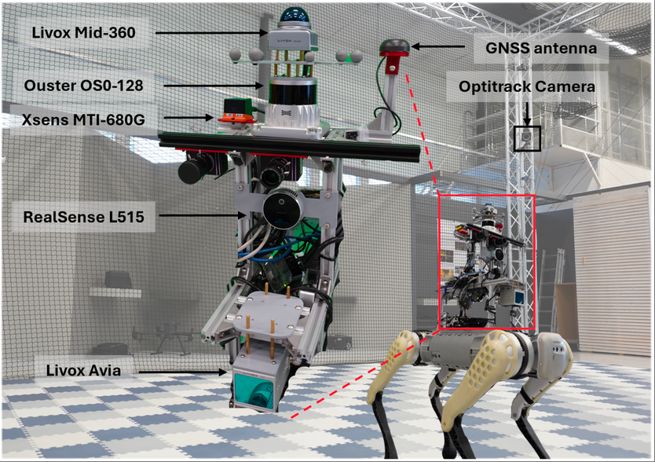
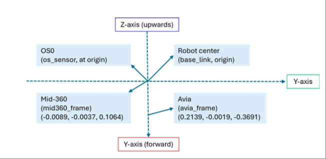
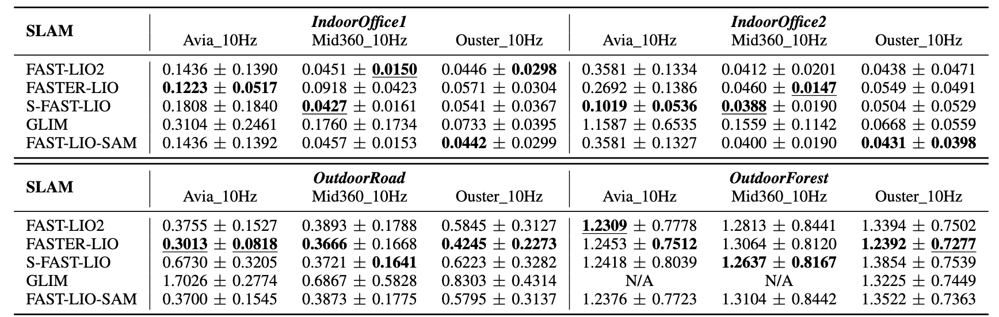
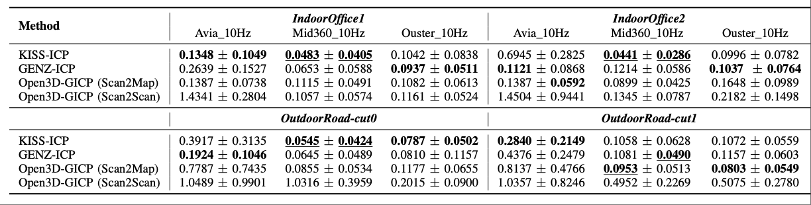
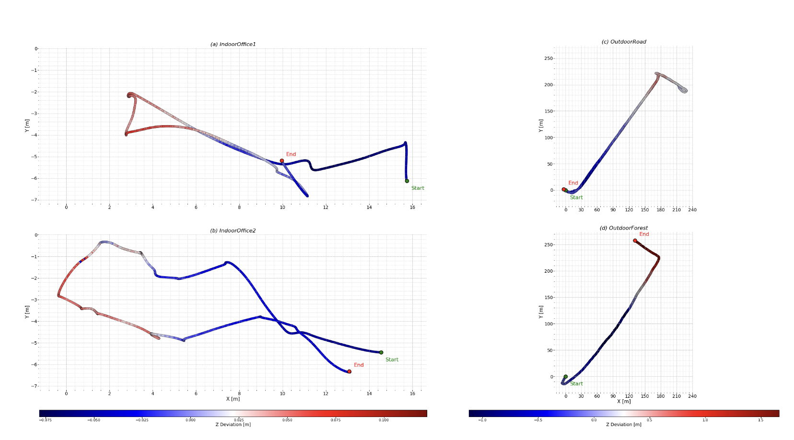
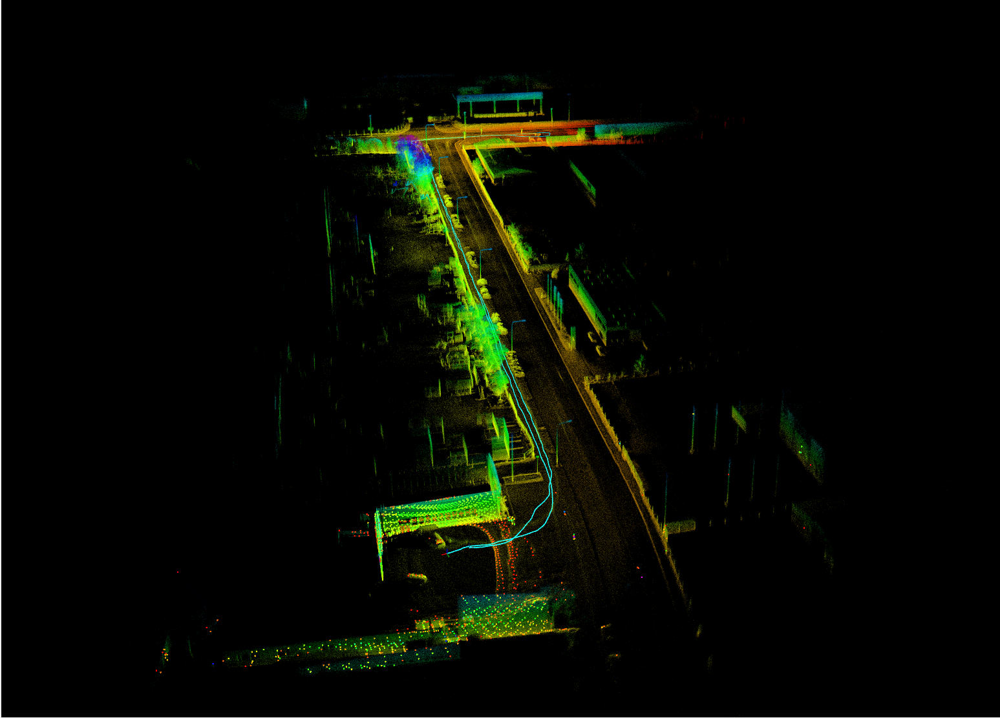
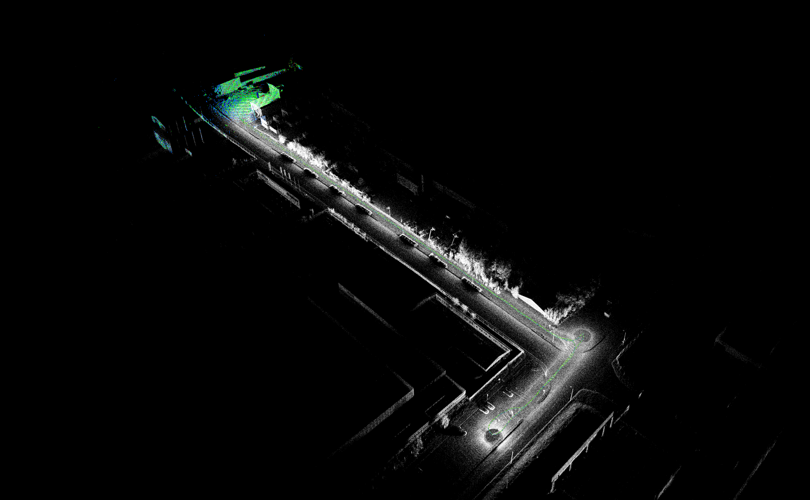
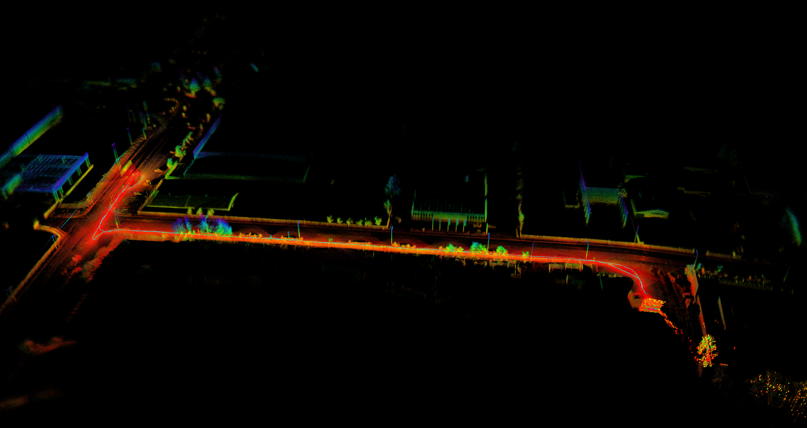
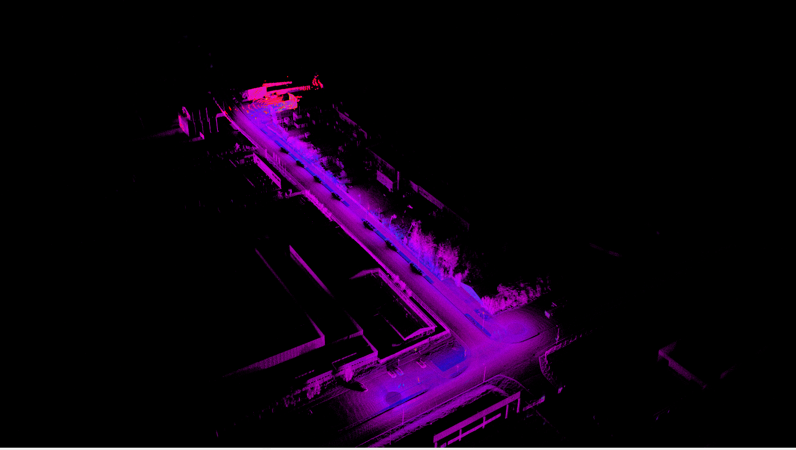
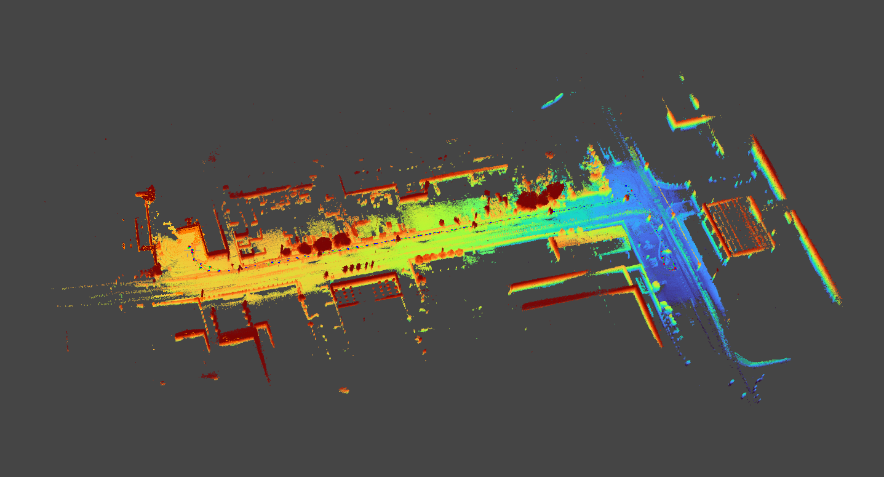

# Multi-Modal LiDAR Dataset (Avia • Mid-360 • Ouster)

> **Status:** Pre-release (dataset links below).  
> **Paper:** *Understanding LiDAR Variability: A Dataset and Comparative Study of Solid-State and Spinning LiDARs* (under review).

This repository hosts **documentation, download links, and baseline code** for a multi-LiDAR dataset featuring:
- **Livox Avia** (solid-state, limited FoV)
- **Livox Mid-360** (dome-shaped solid-state)
- **Ouster OS0-128** (spinning)

---
### 1) Data Collection Platform
Robot and sensors setup:

<p align="center">
  
  
</p>

---
## 2) Quick Links

**Dataset Download (Baidu Netdisk):**

<table>
  <thead>
    <tr>
      <th>Sequence</th>
      <th>Size</th>
      <th>Download</th>
      <th>Notes</th>
    </tr>
  </thead>
  <tbody>
    <tr>
      <td>IndoorOffice1</td>
      <td>4.47&nbsp;GB</td>
      <td><a href="https://pan.baidu.com/s/1sAiaXva7OY0z7ILK0nIv1w">Baidu</a> (pwd: <code>ec2t</code>)</td>
      <td>Indoor office environment 1.</td>
    </tr>
    <tr>
      <td>IndoorOffice2</td>
      <td>6.46&nbsp;GB</td>
      <td><a href="https://pan.baidu.com/s/1g64HCeztEmPRc-rdee_oew">Baidu</a> (pwd: <code>5yxp</code>)</td>
      <td>Indoor office environment 2.</td>
    </tr>
    <tr>
      <td>OutdoorRoad</td>
      <td>44.48&nbsp;GB</td>
      <td><a href="https://pan.baidu.com/s/1O7MBU-5u8taKWxgpxwJJwQ">Baidu</a> (pwd: <code>uk1e</code>)</td>
      <td>Long structured road scene.</td>
    </tr>
    <tr>
      <td>OutdoorRoad_cut0</td>
      <td>4.47&nbsp;GB</td>
      <td><a href="https://pan.baidu.com/s/1D3BiAND8qwbKwoCiSFW0sA">Baidu</a> (pwd: <code>eyu9</code>)</td>
      <td>Road scene (first segment) .</td>
    </tr>
    <tr>
      <td>OutdoorRoad_cut1</td>
      <td>3.07&nbsp;GB</td>
      <td><a href="https://pan.baidu.com/s/1np_ye1Wt1Sucwv5JamCvmA">Baidu</a> (pwd: <code>6xsa</code>)</td>
      <td>Road scene (second segment).</td>
    </tr>
    <tr>
      <td>OutdoorForest</td>
      <td>23.59&nbsp;GB</td>
      <td><a href="https://pan.baidu.com/s/15V13tQ_k_ukbimko7NR99w">Baidu</a> (pwd: <code>isev</code>)</td>
      <td>Off-road forest trail with foliage—more degenerate geometry for LiDAR.</td>
    </tr>
  </tbody>
</table>

---

## 3) Verify Dataset Integrity

1. Download bags from the links above.
2. Place each `.bag` in its corresponding folder under `dataset/`:
   - IndoorOffice1 → `dataset/indoor/IndoorOffice1/`
   - IndoorOffice2 → `dataset/indoor/IndoorOffice2/`
   - OutdoorRoad → `dataset/outdoor/OutdoorRoad/`
   - OutdoorRoad-cut0 → `dataset/outdoor/OutdoorRoad-cut0/`
   - OutdoorRoad-cut1 → `dataset/outdoor/OutdoorRoad-cut1/`
   - OutdoorForest → `dataset/outdoor/OutdoorForest/`
3. Run verification (example for IndoorOffice1):
   ```bash
   cd dataset/indoor/IndoorOffice1
   sha256sum -c IndoorOffice1.sha256
   ```
   Expected output:
   ```
   IndoorOffice1_dataset.bag: OK
   ```
   Repeat for the other sequences using their respective `.sha256` files.

---
## 4) Dataset Layout

Each sequence provides synchronized rosbags and metadata:

```
dataset/
  indoor/
    IndoorOffice1/
    IndoorOffice2/
  outdoor/
    OutdoorRoad/
    OutdoorRoad-cut0/
    OutdoorRoad-cut1/
    OutdoorForest/
```
---

## 5) ROS Topics

<div style="display:flex; gap:1rem; flex-wrap:wrap;">
  <div style="flex:1; min-width:320px;">
    <h4>IndoorOffice1 (4.47GB)</h4>
    <table>
      <thead><tr><th>Topic</th><th>#Msgs</th><th>Type</th></tr></thead>
      <tbody>
        <tr><td>/avia/livox/imu</td><td>13,461</td><td>sensor_msgs/Imu</td></tr>
        <tr><td>/avia/livox/lidar</td><td>662</td><td>sensor_msgs/PointCloud2</td></tr>
        <tr><td>/mid360/livox/imu</td><td>13,212</td><td>sensor_msgs/Imu</td></tr>
        <tr><td>/mid360/livox/lidar</td><td>660</td><td>sensor_msgs/PointCloud2</td></tr>
        <tr><td>/ouster/imu</td><td>8,257</td><td>sensor_msgs/Imu</td></tr>
        <tr><td>/ouster/points</td><td>661</td><td>sensor_msgs/PointCloud2</td></tr>
        <tr><td>/vrpn_client_node/unitree_b1/pose</td><td>7,664</td><td>geometry_msgs/PoseStamped</td></tr>
      </tbody>
    </table>
  </div>
  <div style="flex:1; min-width:320px;">
    <h4>IndoorOffice2 (6.46GB)</h4>
    <table>
      <thead><tr><th>Topic</th><th>#Msgs</th><th>Type</th></tr></thead>
      <tbody>
        <tr><td>/avia/livox/imu</td><td>19,449</td><td>sensor_msgs/Imu</td></tr>
        <tr><td>/avia/livox/lidar</td><td>957</td><td>sensor_msgs/PointCloud2</td></tr>
        <tr><td>/mid360/livox/imu</td><td>19,124</td><td>sensor_msgs/Imu</td></tr>
        <tr><td>/mid360/livox/lidar</td><td>957</td><td>sensor_msgs/PointCloud2</td></tr>
        <tr><td>/ouster/imu</td><td>11,939</td><td>sensor_msgs/Imu</td></tr>
        <tr><td>/ouster/points</td><td>955</td><td>sensor_msgs/PointCloud2</td></tr>
        <tr><td>/vrpn_client_node/unitree_b1/pose</td><td>8,513</td><td>geometry_msgs/PoseStamped</td></tr>
      </tbody>
    </table>
  </div>
</div>

---

<div style="display:flex; gap:1rem; flex-wrap:wrap;">
  <div style="flex:1; min-width:320px;">
    <h4>OutdoorRoad (44.48GB)</h4>
    <table>
      <thead><tr><th>Topic</th><th>#Msgs</th><th>Type</th></tr></thead>
      <tbody>
        <tr><td>/avia/livox/imu</td><td>133,719</td><td>sensor_msgs/Imu</td></tr>
        <tr><td>/avia/livox/lidar</td><td>6,573</td><td>sensor_msgs/PointCloud2</td></tr>
        <tr><td>/gnss_pose</td><td>65,732</td><td>geometry_msgs/PoseStamped</td></tr>
        <tr><td>/mid360/livox/imu</td><td>131,462</td><td>sensor_msgs/Imu</td></tr>
        <tr><td>/mid360/livox/lidar</td><td>6,573</td><td>sensor_msgs/PointCloud2</td></tr>
        <tr><td>/ouster/imu</td><td>82,162</td><td>sensor_msgs/Imu</td></tr>
        <tr><td>/ouster/points</td><td>6,573</td><td>sensor_msgs/PointCloud2</td></tr>
      </tbody>
    </table>
  </div>
  <div style="flex:1; min-width:320px;">
    <h4>OutdoorForest (23.59GB)</h4>
    <table>
      <thead><tr><th>Topic</th><th>#Msgs</th><th>Type</th></tr></thead>
      <tbody>
        <tr><td>/avia/livox/imu</td><td>61,834</td><td>sensor_msgs/Imu</td></tr>
        <tr><td>/avia/livox/lidar</td><td>30,410</td><td>sensor_msgs/PointCloud2</td></tr>
        <tr><td>/gnss</td><td>1,216</td><td>sensor_msgs/NavSatFix</td></tr>
        <tr><td>/gnss_pose</td><td>30,410</td><td>geometry_msgs/PoseStamped</td></tr>
        <tr><td>/imu/data</td><td>30,410</td><td>sensor_msgs/Imu</td></tr>
        <tr><td>/imu/mag</td><td>30,410</td><td>sensor_msgs/MagneticField</td></tr>
        <tr><td>/mid360/livox/imu</td><td>60,819</td><td>sensor_msgs/Imu</td></tr>
        <tr><td>/mid360/livox/lidar</td><td>30,410</td><td>sensor_msgs/PointCloud2</td></tr>
        <tr><td>/ouster/imu</td><td>38,012</td><td>sensor_msgs/Imu</td></tr>
        <tr><td>/ouster/nearir_image</td><td>3,041</td><td>sensor_msgs/Image</td></tr>
        <tr><td>/ouster/points</td><td>3,041</td><td>sensor_msgs/PointCloud2</td></tr>
        <tr><td>/ouster/range_image</td><td>3,041</td><td>sensor_msgs/Image</td></tr>
        <tr><td>/ouster/reflec_image</td><td>3,041</td><td>sensor_msgs/Image</td></tr>
        <tr><td>/ouster/signal_image</td><td>3,041</td><td>sensor_msgs/Image</td></tr>
        <tr><td>/tf</td><td>71,463</td><td>tf2_msgs/TFMessage</td></tr>
      </tbody>
    </table>
  </div>
</div>

---

<div style="display:flex; gap:1rem; flex-wrap:wrap;">
  <div style="flex:1; min-width:320px;">
    <h4>OutdoorRoad_cut0 (4.47GB)</h4>
    <table>
      <thead><tr><th>Topic</th><th>#Msgs</th><th>Type</th></tr></thead>
      <tbody>
        <tr><td>/avia/livox/imu</td><td>13,429</td><td>sensor_msgs/Imu</td></tr>
        <tr><td>/avia/livox/lidar</td><td>660</td><td>sensor_msgs/PointCloud2</td></tr>
        <tr><td>/gnss_pose</td><td>6,602</td><td>geometry_msgs/PoseStamped</td></tr>
        <tr><td>/mid360/livox/imu</td><td>13,200</td><td>sensor_msgs/Imu</td></tr>
        <tr><td>/mid360/livox/lidar</td><td>660</td><td>sensor_msgs/PointCloud2</td></tr>
        <tr><td>/ouster/imu</td><td>8,249</td><td>sensor_msgs/Imu</td></tr>
        <tr><td>/ouster/points</td><td>660</td><td>sensor_msgs/PointCloud2</td></tr>
      </tbody>
    </table>
  </div>
  <div style="flex:1; min-width:320px;">
    <h4>OutdoorRoad_cut1 (3.07GB)</h4>
    <table>
      <thead><tr><th>Topic</th><th>#Msgs</th><th>Type</th></tr></thead>
      <tbody>
        <tr><td>/avia/livox/imu</td><td>9,214</td><td>sensor_msgs/Imu</td></tr>
        <tr><td>/avia/livox/lidar</td><td>453</td><td>sensor_msgs/PointCloud2</td></tr>
        <tr><td>/gnss_pose</td><td>4,528</td><td>geometry_msgs/PoseStamped</td></tr>
        <tr><td>/mid360/livox/imu</td><td>9,055</td><td>sensor_msgs/Imu</td></tr>
        <tr><td>/mid360/livox/lidar</td><td>453</td><td>sensor_msgs/PointCloud2</td></tr>
        <tr><td>/ouster/imu</td><td>5,659</td><td>sensor_msgs/Imu</td></tr>
        <tr><td>/ouster/points</td><td>453</td><td>sensor_msgs/PointCloud2</td></tr>
      </tbody>
    </table>
  </div>
</div>

---

## Ground Truth

- **Indoor:** MoCap (`/vrpn_client_node/unitree_b1/pose`)
- **Outdoor:** GNSS-RTK (`/gnss_pose`)

---

### Sensor Frequency Notes

| Topic               | IndoorOffice1/2 | OutdoorRoad | OutdoorForest |
|----------------------|-----------------|-------------|---------------|
| `/ouster/points`    | ~10 Hz          | ~10 Hz      | ~10 Hz        |
| `/ouster/imu`       | ~100 Hz         | ~100 Hz     | ~125 Hz       |
| `/avia/livox/lidar` | 10 Hz           | 10 Hz       | **100 Hz**    |
| `/avia/livox/imu`   | ~200 Hz         | ~200 Hz     | ~200 Hz       |
| `/mid360/livox/lidar` | 10 Hz         | 10 Hz       | **100 Hz**    |
| `/mid360/livox/imu` | ~200 Hz         | ~200 Hz     | ~200 Hz       |

> **Note:** In OutdoorForest, Avia and Mid360 LiDARs run at **100 Hz** (denser stream) instead of 10 Hz.  
> The Ouster IMU also runs slightly faster (~125 Hz vs ~100 Hz).
---

## 6) Processing & Reproduction Pipelines

See [docs/pipelines/README.md](docs/pipelines/README.md) for detailed steps, commands, and node graphs.

**Quick overview:**
- Outdoor: GNSS→odom conversion, Livox conversion, run SLAM, record odometry + GNSS.
- Indoor: Livox conversion, run SLAM, record odometry + MoCap.
---

## 7) Trajectory Export & Evaluation

1. Export TUM files using `scripts/bag_tools/bag_tum.py`. Example:
   ```bash
   python3 scripts/bag_tools/bag_tum.py \
     --odom_bag recorded.bag --odom_topic /odometry \
     --gt_bag   recorded.bag --gt_topic /odom \
     --odom_out odom.tum --gt_out gt.tum
   ```
2. Run evaluation with `evo_ape`:
   ```bash
   evo_ape tum --align gt.tum odom.tum \
     --plot --plot_mode xyz -r trans_part --save_plot ape_trans.png
   ```

---

## 8) Baseline Methods

We tested several open-source SLAM and registration methods on this dataset:

- **FAST-LIO2** – tightly coupled LiDAR-inertial odometry ([GitHub](https://github.com/hku-mars/FAST_LIO))  
- **Faster-LIO** – optimized FAST-LIO variant ([GitHub](https://github.com/gaoxiang12/faster-lio))  
- **S-FAST-LIO** – surfel-based LiDAR-inertial odometry ([GitHub](https://github.com/zlwang7/S-FAST_LIO))  
- **FAST-LIO-SAM** – combines FAST-LIO’s front-end odometry with the loop closure and mapping backend of LIO-SAM ([GitHub](https://github.com/kahowang/FAST_LIO_SAM))  
- **GLIM** – factor graph-based LiDAR-inertial mapping ([GitHub](https://github.com/koide3/glim))  
- **KISS-ICP** – lightweight point-to-point ICP odometry, efficient and IMU-free (ROS1 compatible v0.3.0) ([GitHub](https://github.com/PRBonn/kiss-icp))  
- **GenZ-ICP** – generalized ICP variant with multi-scale feature integration for robustness ([GitHub](https://github.com/cocel-postech/genz-icp))  
- **Open3D-GICP** – Open3D’s implementation of Generalized ICP, integrated for ROS via `open3d_catkin` ([GitHub](https://github.com/leggedrobotics/open3d_slam/tree/master/open3d_catkin))  

---

## 9) Results & Visualizations

### Quantitative Results
SLAM methods (APE RMSE, mean ± std) on indoor and outdoor datasets:



ICP-based methods (APE RMSE, mean ± std):



---

### Trajectory Alignments
Indoor and outdoor designated ground-truth paths of all the collected data sequences:



---

### Example Outdoor SLAM Runs
<p align="center">
  
  
</p>

<p align="center">
  
  
</p>

<p align="center">
  
</p>
---

## 10) Contact

Please open an issue or discussion on this repo for questions.
