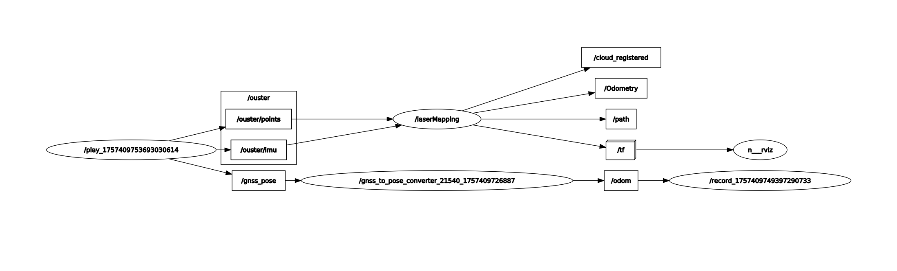
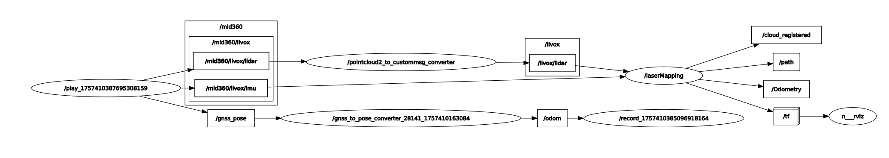
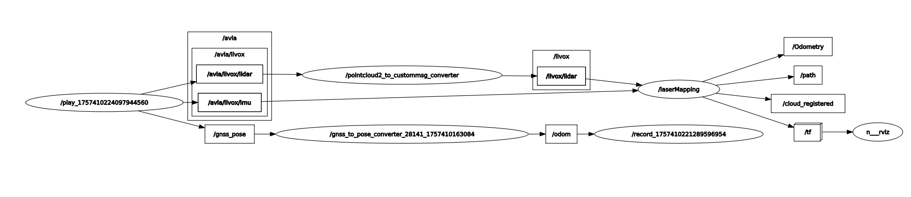

# Processing & Reproduction Pipelines

This document describes how to reproduce SLAM/ICP experiments with the **Multi-Modal LiDAR Dataset**, including node graphs, conversion steps, and evaluation workflows.  

---

## 1) Outdoor Workflow

### 1.1 GNSS Conversion
The original outdoor ground truth is in **latitude/longitude** format on topic `/gnss_pose`.  
After building the `scripts/gnss2odom/` code into a catkin package (`gnss2odom_converter`), convert to `/odom` (ENU coordinates) using:

```bash
rosrun gnss2odom_converter gnss2odom.py
```
---

### 1.2 Livox PointCloud Conversion
The **FAST-LIO family** requires Livox CustomMsg format.
For **Avia** and **Mid-360**, convert `sensor_msgs/PointCloud2` to `livox_ros_driver/CustomMsg` with:

```bash
roslaunch pointcloud2_to_custommsg_converter converter.launch
```

**Note:** Ouster `/ouster/points` can be used directly (no conversion required).
**Note:** The pointcloud2_to_custommsg_converter will be provided in a separate repo: [link will be added]

---

### 1.3 Run FAST-LIO2
Example launch (replace topics as needed):

```bash
roslaunch fast_lio mapping.launch \
    lidar_points:=/ouster/points \
    imu:=/ouster/imu
```

Node graph example (Ouster with FAST-LIO2):



Node graph example (Mid-360 with FAST-LIO2):



Node graph example (Avia with Faster-LIO):



---

### 1.4 Record Outputs
Record both SLAM and ground truth:

```bash
rosbag record /odometry /odom
```
-

## 2) Indoor Workflow

For indoor data, ground truth is MoCap from `/vrpn_client_node/unitree_b1/pose`.

### 2.1 Conversion
- Avia + Mid-360: Convert `PointCloud2` → Livox CustomMsg.  
- Ouster: Use directly.  

### 2.2 Run SLAM
Run FAST-LIO2/Faster-LIO as above.  

### 2.3 Record Outputs
Record both SLAM and ground truth:

```bash
rosbag record /odometry /vrpn_client_node/unitree_b1/pose
```
---

## 3) Trajectory Export

Use the helper script scripts/bag_tools/bag_tum.py to export TUM trajectories.
Run this on the rosbag you recorded during SLAM (not the raw dataset bag):

```bash
python3 scripts/bag_tools/bag_tum.py \
  --odom_bag recorded.bag --odom_topic /odometry \
  --gt_bag recorded.bag --gt_topic /odom \
  --odom_out odom.tum --gt_out gt.tum
```
(For indoor, set `--gt_topic /vrpn_client_node/unitree_b1/pose`.)

---

## 4) Evaluation with evo

Run Absolute Pose Error (APE) evaluation:

```bash
evo_ape tum --align gt.tum odom.tum \
  --plot --plot_mode xyz -r trans_part --save_plot ape_trans.png
```
Optionally, run Relative Pose Error (RPE):

```bash
evo_rpe tum gt.tum odom.tum \
  -r trans_part --plot --save_plot rpe_trans.png
```

Example evaluation wrapper script (`examples/slam/evaluate_with_evo.sh`):

```bash
#!/usr/bin/env bash
set -e
GT=$1
EST=$2
OUT=${3:-ape_result.png}
evo_ape tum --align "$GT" "$EST" \
  --plot --plot_mode xyz -r trans_part --save_plot "$OUT"
```

---

## 5) Summary

- **Outdoor:** Requires GNSS→odom conversion, plus Livox conversion if using Avia/Mid-360.  
- **Indoor:** Only Livox conversion required.  
- **All sequences:** Record `/odometry` + ground truth, export with `bag_tum.py`, evaluate with `evo_ape`.
